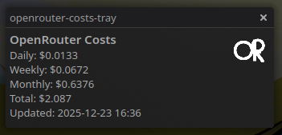
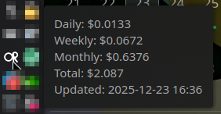
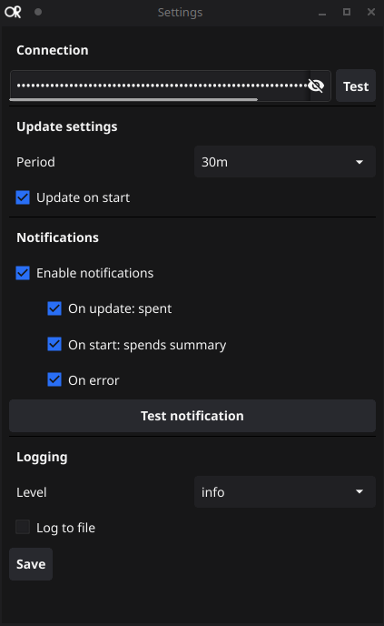

# OpenRouter Costs Tray




Tiny cross-platform tray app that shows OpenRouter usage and cost updates.

## Build

```
go build ./cmd/openrouter-costs-tray
```

## Run

```
./openrouter-costs-tray
```

## Config

Config is stored in the user config directory (see Settings window). The app expects an OpenRouter API key.


